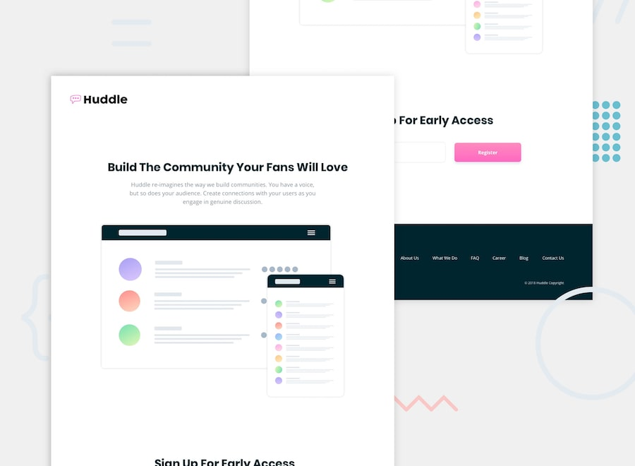

# Frontend Mentor - Huddle landing page with single column layout

## Welcome! 👋

Thanks for checking out this front-end coding challenge. This page started life as a Frontend Mentor Challenge. 🎉 Coded by [Nitya Gulati](https://nityagulati.github.io/).

[Frontend Mentor](https://www.frontendmentor.io) challenges allow you to improve your skills in a real-life workflow.

**To do these challenges, you need a basic understanding of HTML, CSS and (sometimes) JavaScript.**

## Where to find everything

Your task is to build out the project to the designs inside the `/design` folder. You will find both a mobile and a desktop version of the design to work to. 

You can access all the required assets and the style guide on the Frontend Mentor website. 

## Sharing your solution

We can all learn from each other's solution, so everyone would love to see your code. There is a Slack community, which you can sign up to on the Frontend Mentor website. Post the link to your repository there and get feedback from the community.

If you decide to push the project live, tweet [@frontendmentor](https://twitter.com/frontendmentor). Mention **@frontendmentor** and include the URL in the tweet. We'd love to take a look at what you've built and help share it around.

## Giving feedback

Feedback is always welcome, so if you have any on this challenge please email Matt at matt[at]frontendmentor[dot]io.

This challenge is completely free. Please share it with anyone who will find it useful to practice on.

**Have fun building!** 🚀
